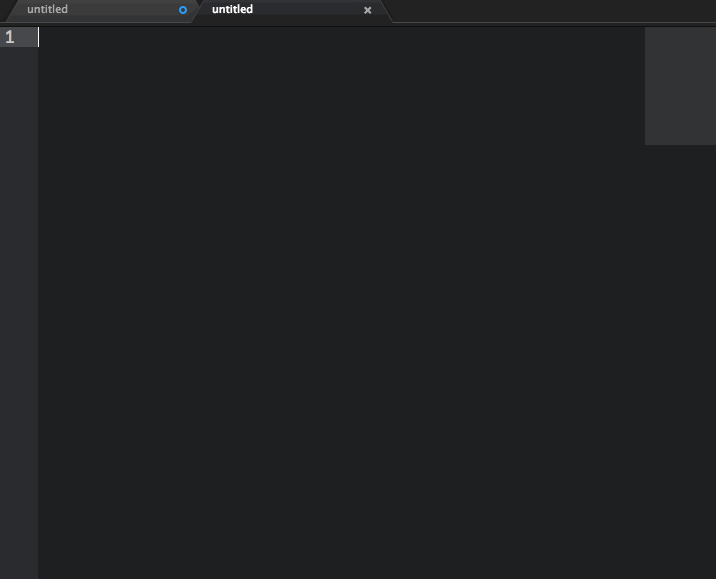
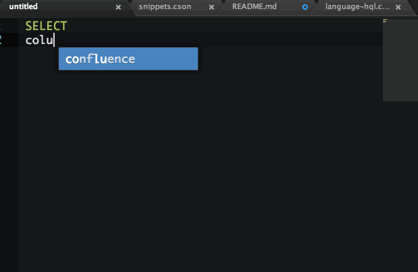

# HQL (Apache Hive) query language support in Atom  

### `(((o(*ﾟ▽ﾟ*)o))) New UDfs and Keywords added !`

Works for *Apache Hive* and *Apache Pig* syntax and other SQL-like languages.
See [hive language manual UDF](https://cwiki.apache.org/confluence/display/Hive/LanguageManual+UDF) and [hive language manual DDL]( https://cwiki.apache.org/confluence/display/Hive/LanguageManual+DDL) for more information on the language.

* Adds syntax highlighting to HQL files in Atom.
* Converts HQL grammar to uppercase
* Added AutoComplete Functionality, requires: **autocomplete-snippets** and **autocomplete-plus**
* In order to use the snippets press `alt+shift+s` which will prompt autocomplete snippets to load the .hql snippets
* To enable snippets to be suggested and used in for tab completion, copy `~/.atom/packages/language-hql/snippets/language-hql.cson` to `~/.atom/snippets.cson`

# Adapted from language-sql Atom package, currently contains the following HQL specific syntax.

* String Functions
* Built-in Aggregate Functions (UDAF)
* Conditional Functions
* Date Functions
* Type Conversion Functions
* Fixed uppercasing with DOM Shadow support
* Built-in Table-Generating Functions (UDTF)
* Misc. Functions (e.g. hash)
* Brickhouse UDFs
* Some Facebook UDFs
* Some Custom UDFs
* Collection Functions
* Mathematical Functions
* Relational Operators
* Arithmetic Operators
* Logical Operators
* Complex Type Constructors
* Operators on Complex Types

# Contributing

Contributions are greatly appreciated. Please fork this repository and open a
pull request to add snippets, make grammar tweaks, etc...
